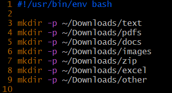
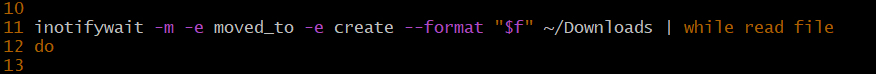
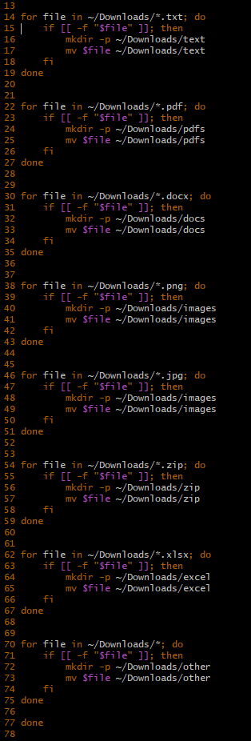

---------------------------
DOWNLOADS ORGANIZER SERVICE
---------------------------

---Description---

This script starts when you power on your computer and continuously runs in the background. 
It monitors your /Downloads directory for files that are either moved into it, or created there.
Once it detects a file, it moves it into the corresponding directory of the matching type. 
If the file is of an unspecified type, such as mp4 or wav, it will be put into the /other directory.
If you happen to delete a folder and then download a file with that type, the script will create a new folder of the same type and sort the file into it. 

---Installation---

For this script to run you need to move the two scrips I have created into the correct folders.

1.
Clone my repository into whichever directory you wish using:
git clone git@github.com:morrisaronsson/dlorg_morris_aronsson.git

2.
dlorg
This is the script which monitors and organizes your Downloads directory. 
Move it into: ~/home/local/bin. 

3.
backup-desktop.service
This is the service which starts up the script as your computer starts and then runs it continuously.
Move it into: ~/.config/systemd/user

4.
Next you will start it up, do the following:

sudo systemctl daemon-reload
(It will ask for you password.)

systemctl --user enable downloads-organizer.service
This will create a symlink between the two scripts.

systemctl start downloads-organizer
This will start the program. It will then start automatically everytime you boot up your computor.

---How it works---

1. Creating the directories

Screenshot

The first line is the shebang line which tells Linux to use the bash interpreter to run the script.

The other lines of code use the mkdir command to create 7 diffrent directories within your Downloads directory. It uses -p so that if there is already a directory with that same name, it doesn´t create one, that way it will not overwrite any existing directories. 

2. Monitoring Downloads

Screenshot

The inotifywait function is the part of the script which watches your Downloads folder and feeds information about new files into a while loop. 
 -m = Monitors Downloads.
 -e = Events trigger the script. The Events it watches for are:
moved_to = Files moved into Downloads.
create = Files created in Downloads.
The event is then piped using | into "while read file do" which reads a line of text and stores it into the variable called file. 
It then tells the script to start executing the commands inside the loop.

3. File sorting

Screenshot

Here the script checks for the diffrent kinds of files and sorts them accordingly. 
"For file in ~/Downloads/" designates files in the Downloads directory.
"*." targets the suffix, or end of the file name. For instance .txt or .png

"; do" then leads into the if statement. 

if [[ -f (checks if its a file) "$file" (the variable set in "while read file do") ]]; then 
mkdir -p ~/Downloads/ = creates a new directory if there isnt one there already.
mv $file ~/Downloads/ = moves it into the correct folder.
fi = ends the if statement
done = completes the check for the specific type.
At the end of the script is an adittional done. That is to end the "while read file do" function and complete the script. 

---LLM usage---
I have used LLM and google to remind of, or further explain to me diffrent codes and functions. 
It helped me figure out that I needed an aditional "done" at the end by explaining how the "while read file do" function should be structured. Specifically reminding me that for each do, there should be a done.

---Issues---
Please report any issues encountered via my email detailed on my github page:
https://github.com/morrisaronsson
